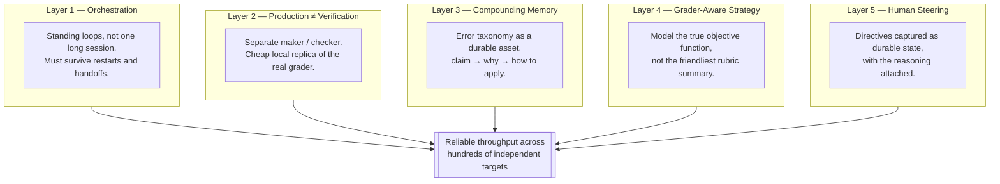
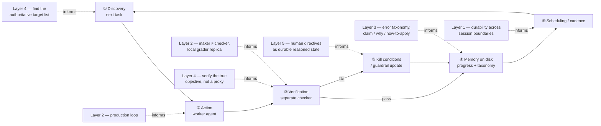

# agentic-research-playbook

**A toolkit for the "brain" of a long-horizon agent loop.**

Most loop-building tools give you the skeleton: find a task, do it, check it, remember it, run again. What they don't give you is judgment: what your checker should actually be looking at, what's worth writing down, when "done" quietly stopped being true. This repo is that judgment, written down as five rules pulled out of a project that leaned on all five harder than most.

The project: an agent fleet that reproduced 363 ICML papers start to finish over about three weeks, finishing first out of several hundred entrants in the Hugging Face *ICML 2026 Agent Reproducibility* hackathon. [PLAYBOOK.md](PLAYBOOK.md) has the full story, incident by incident.

This repo isn't the code from that project. It's what's left after stripping out everything specific to papers and hackathons, so the lessons still hold up on whatever you're looping next.

---

## Why the mechanics alone aren't enough

Picture a factory line that's fully automated but has nobody checking the output. It will stamp out defective parts at the exact same speed as good ones, because speed was never the thing missing. A loop behaves the same way. It doesn't know its own checker is a rubber stamp, that its memory is a pile of notes nobody could act on later, or that something it called "done" three days ago quietly stopped being true when the rules changed underneath it.

Those aren't bugs you patch after the fact. They're calls somebody has to make before the loop runs unattended, and getting them wrong is how a loop spends a whole weekend confidently doing the wrong thing, hundreds of times, before anyone notices.

## The five rules

### Layer 1 — build a lighthouse, not a flashlight

A flashlight only works while a hand is holding it. A lighthouse runs all night with nobody watching, because it was built not to need anyone. A loop that only survives inside one long chat session is a flashlight wearing a lighthouse costume: the moment that session restarts, whatever it was quietly running goes with it, and there's no crash, no error, nothing. It just stops, and a stopped loop looks exactly like a loop that finished everything and has nothing left to do.

The fix isn't clever. Write down every standing job's schedule and purpose somewhere that outlives any one session, and after every restart or handoff, actually check the jobs are alive instead of assuming they still are because they were an hour ago.

### Layer 2 — don't let the author grade their own essay

Ask a student to grade their own essay and they'll read what they meant to write, not what's actually on the page. An agent grading its own output fails the same way, for the same reason: it already believes its own explanation for what it did.

This is concrete, not theoretical. A cheap, fast, local stand-in for the real grader (which was slow, expensive, and rate-limited) once caught a second bug that a proposed fix would have missed completely. Without it, the team would have shipped an artifact that looked fixed and wasn't, and only found out days later when the real grader finally ran. One local check, done by something structurally separate from the thing being checked, was the entire difference.

There's a sharper version of the same rule: once something is marked done, a small edit doesn't necessarily only change the small thing. If the grader re-scores the whole artifact on any touch, a "harmless" tweak can quietly downgrade work that was already passing. Treat every edit to graded work as a re-roll of the whole verdict, not a patch to one corner of it.

### Layer 3 — write doctor's notes, not diary entries

"Patient had a rash" is a diary entry. "Rash cleared, came back after switching to generic amoxicillin, probably a cross-reaction, avoid until confirmed" is a doctor's note. The first is useless to the next patient who walks in with the same symptom. The second tells them exactly what to check, because it comes with a reason attached.

Two findings from the reproducibility project hold up well past papers:

- **The fidelity trap.** A result built on the target's own native-scale object reads as a genuine reproduction. The same result built on a shrunk-down stand-in reads as a toy demo, even when the numbers match to five decimal places. When a real result got misjudged as a stand-in, arguing "it's morally the same" never worked. Pointing at the exact native-scale object and showing the measured number matches the target's own to high precision did.
- **A verdict doesn't know when the rules changed.** Partway through the project, the grading rules shifted, and every artifact scored before that shift kept displaying its old score until something forced a re-check. "Done" from last week isn't guaranteed to still be done under this week's rules.

Write a finding down the moment it's noticed, because the reasoning behind it goes fuzzy fast, and give every entry the same three parts: the claim, why it's true, and when it should change what happens next.

### Layer 4 — study for the exam that's actually graded

A reading list and the exam it's supposedly based on aren't always the same document. Sometimes the exam only covers half the list, or covers something the list never mentioned, and the student who tracked down last year's exam does better than the one who read every page.

On the reproducibility project, the publicly declared list of what needed doing and the list the system actually scored against were two different documents, and sizing effort to the visible one left real points sitting on the table. The value of a unit of work also turned out to follow a formula rather than a flat number, which meant some units the leading competitor had already called "finished" were still worth more effort. The leader had undershot the real ceiling without realizing it.

One more thing worth carrying into any deadline-bound loop: the bottleneck flips as the deadline gets close. Early on, the limit is how fast you can produce work. Near the end, it's the shared evaluator, backed up because everyone rushes at once, and only what's already been confirmed by the time the clock runs out counts. Chasing more volume stops being the right move well before the crunch; chasing more *confirmed* volume takes over.

### Layer 5 — human course-corrections are stone, not water

A spoken instruction in a chat is water. It evaporates the moment the session resets, and nobody notices until the mistake it was meant to prevent happens again. A written directive with its reasoning attached is stone. It's still there next week, and it can be checked against, argued with, and deliberately revised instead of quietly forgotten.

The biggest strategic pivots on the reproducibility project came as short, plain-language directives from the human running it, mid-project, not from anything the system worked out on its own. What made them stick was writing each one down as durable state, reasoning included, in the same turn it was given. "I'll remember this" is exactly the kind of promise a context reset breaks.

---

## How this fits into loop engineering

"Loop engineering" is the practice of building a system that prompts the agent for you instead of you prompting it turn by turn: something that finds work, does it, checks it against explicit criteria, remembers what happened, runs on a schedule, and knows when to stop. That's the skeleton. The five rules above are the judgment that goes inside it, and none of them are specific to research reproduction.

| Loop part (mechanics) | Playbook layer (judgment) | Question to ask before you scale the loop |
|---|---|---|
| ① Discovery | Layer 4 — Grader-aware strategy | Is this the *authoritative* list of what's scored, or just the friendliest-looking summary of it? |
| ② Action | Layer 2 — Production loop | Is the worker producing a complete artifact, or a stub that'll pass a shallow check? |
| ③ Verification | Layer 2 + Layer 4 | Is the checker structurally separate from the maker, and is it checking the *real* objective function? |
| ④ Memory on disk | Layer 3 — Compounding knowledge base | Does each entry have a *why*, or is it just a fact with no diagnostic power for the next edge case? |
| ⑤ Scheduling / cadence | Layer 1 — Orchestration | Does this survive a session restart, or does it silently die and look identical to "nothing to do"? |
| ⑥ Kill conditions | Layer 5 — Human steering | Is the stop/redirect condition durable state with reasoning attached, or a comment that evaporates next session? |

Build the loop's mechanics with whatever tooling already fits: a `while` script, `/loop`, `/goal`, GitHub Actions. Then, before trusting it at scale, run every row of that table against your own setup. Most loops that fail at scale aren't missing a part. They have all six parts and got the judgment inside one of them wrong.

## Using this as a toolkit

Start with whichever layer matches the risk that worries you most right now: a loop that dies quietly (Layer 1), a checker that's really just the worker in a trench coat (Layer 2), the same mistake happening twice (Layer 3), effort aimed at the wrong target (Layer 4), or a human correction that got lost at the last context reset (Layer 5).

Once it's running, the [starter checklist](PLAYBOOK.md#starter-checklist-for-the-next-scaled-agent-campaign) is the seven-item pre-flight from the case study, written to apply outside it. When something breaks, check the [anti-patterns](PLAYBOOK.md#anti-patterns-observed) list before assuming it's a new bug; most loop failures turn out to be a named pattern that already has a name here. And when a new failure mode shows up that isn't on either list, write it down the way Layer 3 describes, so the next time it happens is a lookup instead of a re-diagnosis from scratch.

There's no loop runner or scaffolding in this repo, and that's on purpose. Pair it with whatever loop-building tooling you're already using; this is the part that tells that tooling what to check and why.

If you want this framework as something an agent can actually load and act on rather than prose to remember, see [`ai-sherpa-loop-engineering-harness`](https://github.com/AI-Sherpa/ai-sherpa-loop-engineering-harness) — a Claude Code skill that turns these five layers into reference docs plus copyable templates (a jobs registry, an eval log, a knowledge log, a grader-model worksheet, a directives log), paired with a sibling skill for the single-loop mechanics underneath them.

## Repo layout

| File | Purpose |
|---|---|
| [`PLAYBOOK.md`](PLAYBOOK.md) | The full framework: all five layers, anti-patterns, starter checklist, case study numbers |
| `README.md` | This file, orientation and the loop-engineering mapping |
| `AGENTS.md` | Working conventions for editing this repo (prose-only, domain-agnostic, claim-must-trace-to-incident) |
