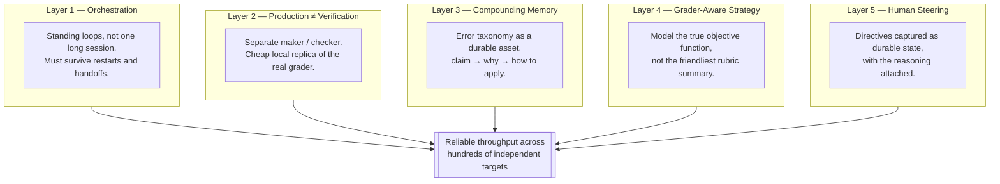
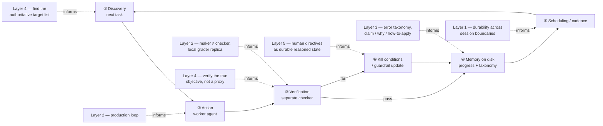

# agentic-research-playbook

**A toolkit for the "brain" of a long-horizon agent loop** — the judgment calls that decide *what* to verify, *what* to remember, and *what* "done" actually means, as opposed to the mechanics of running the loop itself.

Distilled from operating an agent fleet that reproduced **363 ICML papers** end-to-end (build → verify → publish → defend against re-grading) over ~3 weeks, finishing **1st of several hundred entrants** in the Hugging Face *ICML 2026 Agent Reproducibility* hackathon (+54 pts over 2nd place). See **[PLAYBOOK.md](PLAYBOOK.md)** for the full framework with incident-level detail.

This repo is the reusable distillation, not the source project — competition-specific tooling and identifiers are deliberately excluded so the lessons transfer to unrelated future work. There is no code here to install; it's a set of operating principles you apply when you design a loop.

---

## What problem this solves

Any framework that lets you *build* a loop (discover work → act → verify → persist state → schedule → know when to stop) will happily run a badly-designed loop just as fast as a good one. The tooling can't tell you:

- whether your verifier is actually checking the thing that matters, or a friendlier proxy for it
- what shape your memory needs to have to actually prevent repeat mistakes, versus just accumulating logs
- whether an artifact your loop already marked "done" is still done under the current rules
- when to stop producing more work and start confirming the work you already have

Those are judgment calls, and getting them wrong is how a loop burns a weekend confidently doing the wrong thing at scale. This playbook is that judgment, written down as five layers.

## The five-layer operating model

Each layer has its own failure mode if it's missing — see **[PLAYBOOK.md](PLAYBOOK.md)** for what actually broke and how it was caught. Short version: skip Layer 1 and the loop silently dies on a session reset; skip Layer 2 and the loop grades its own homework; skip Layer 3 and every incident gets re-diagnosed from zero; skip Layer 4 and effort goes to the visible rubric instead of the scored one; skip Layer 5 and every human correction evaporates at the next context reset.

## How this fits into loop engineering

"Loop engineering" here means designing a system that prompts the agent for you: it discovers work, acts, verifies the result against explicit criteria, persists state, runs on a cadence, and knows when to stop. That structure — the six mechanical parts below — is necessary but not sufficient. This playbook is what you bring to fill in the judgment inside each part, for *any* long-horizon task, not just research reproduction.

| Loop part (mechanics) | Playbook layer (judgment) | Question to ask before you scale the loop |
|---|---|---|
| ① Discovery | Layer 4 — Grader-aware strategy | Is this the *authoritative* list of what's scored, or just the friendliest-looking summary of it? |
| ② Action | Layer 2 — Production loop | Is the worker producing a complete artifact, or a stub that'll pass a shallow check? |
| ③ Verification | Layer 2 + Layer 4 | Is the checker structurally separate from the maker, and is it checking the *real* objective function? |
| ④ Memory on disk | Layer 3 — Compounding knowledge base | Does each entry have a *why*, or is it just a fact with no diagnostic power for the next edge case? |
| ⑤ Scheduling / cadence | Layer 1 — Orchestration | Does this survive a session restart, or does it silently die and look identical to "nothing to do"? |
| ⑥ Kill conditions | Layer 5 — Human steering | Is the stop/redirect condition durable state with reasoning attached, or a comment that evaporates next session? |

The takeaway: build the loop's mechanics with whatever tooling fits (a `while` script, `/loop`, `/goal`, GitHub Actions), then run every part of it through this table before trusting it at scale.

## Using this as a toolkit

1. **Before scaling a loop**, read the layer whose failure mode matches your biggest risk right now — durability (Layer 1), self-grading (Layer 2), repeat mistakes (Layer 3), wrong target (Layer 4), or lost human context (Layer 5).
2. **While running it**, apply the [starter checklist](PLAYBOOK.md#starter-checklist-for-the-next-scaled-agent-campaign) — it's the seven-item pre-flight from the case study, written to be domain-agnostic.
3. **When something goes wrong**, check it against the [anti-patterns](PLAYBOOK.md#anti-patterns-observed) list first — most loop failures are a named pattern, not a novel bug.
4. **As you learn new failure modes**, log them the way Layer 3 describes — claim, why, how to apply — so the next incident is a lookup, not a re-derivation.

This repo doesn't include a loop runner, scaffolding, or scripts — pair it with whatever loop-building tooling you already use. This is the layer that tells that tooling what to check and why.

## Repo layout

| File | Purpose |
|---|---|
| [`PLAYBOOK.md`](PLAYBOOK.md) | The full framework: all five layers, anti-patterns, starter checklist, case study numbers |
| `README.md` | This file — orientation and the loop-engineering mapping |
| `AGENTS.md` | Working conventions for editing this repo (prose-only, domain-agnostic, claim-must-trace-to-incident) |
